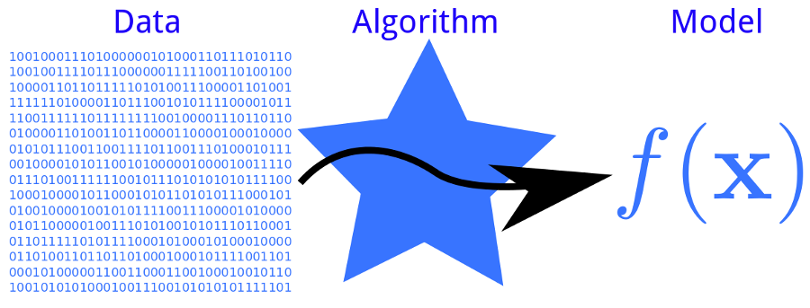

#### About this repository

This repository is meant to be a growing collection of interesting and useful algorithms implemented in Python, Jupyter Notebooks and R. Most of the Machine Learning algorithm implementation is accompanied by the data and the scripts. 

## Table of Contents and Code Notebooks

1. Linear Regression on Wine recognition data [[ipnyb](/Wine_Analysis/Wine_Linear Regression.ipynb)] 

 - This analysis is on the data which are the results of a chemical analysis of wines grown in the same region in Italy but derived from three different cultivars.
The initial analysis is  a basic linear regression. 

- Second part of the analysis is the implementation on TensorFlow.  

