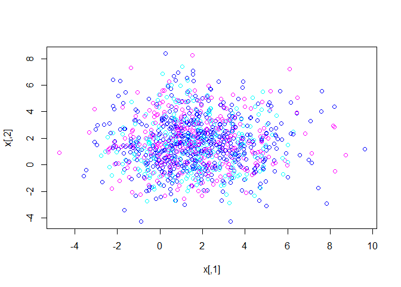
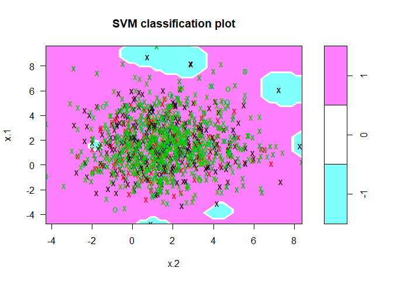

SVM Classification
================
Venkatramani Rajgpal

### Initialise

``` r
#setwd("C:/Users/Venkatramani/Desktop/Test")
```

Load data

``` r
data_c <- read.csv('classification_data.csv', header = TRUE)
```

Remove 8th cycle from the data.

``` r
data.new <- data_c[data_c$Cycle!=8,]
```

### Training a classification model for the target variable 'Result' using Library `e1071`

``` r
library(e1071)
```

    ## Warning: package 'e1071' was built under R version 3.2.5

``` r
# Convert the two variables 'value0.1' and 'value0.2' into matrix form. 
x = matrix(data.new$value.0.1,data.new$value.0.2,nrow = nrow(data.new), ncol = 2)

# Map the target variable 'Result' to y. 
y = c(data.new$Result)

# Plot the result. #13 to equalise the x and y lengths. 
plot(x, col=(13-y))
```



Fit the svm model using the 'radial' kernel.

``` r
dat=data.frame(x=x, y=as.factor(y))

svmfit=svm(y~., data=dat, kernel="radial",scale=FALSE)
plot(svmfit, dat)
```



Summary of the fitted svm using e1071.

``` r
summary(svmfit)
```

    ## 
    ## Call:
    ## svm(formula = y ~ ., data = dat, kernel = "radial", scale = FALSE)
    ## 
    ## 
    ## Parameters:
    ##    SVM-Type:  C-classification 
    ##  SVM-Kernel:  radial 
    ##        cost:  1 
    ##       gamma:  0.5 
    ## 
    ## Number of Support Vectors:  2003
    ## 
    ##  ( 526 644 833 )
    ## 
    ## 
    ## Number of Classes:  3 
    ## 
    ## Levels: 
    ##  -1 0 1

The model shows a low value of cost and a good gamma.

Run the prediction and the execution time.

``` r
pred <- predict(svmfit,x)
system.time(pred <- predict(svmfit,x))
```

    ##    user  system elapsed 
    ##    0.29    0.00    0.28

Finally. Lets tune the model using `tune()` to find the best cost and gamma. `tune()` performs ten-fold cross-validation on a set of models of interest.

``` r
svm_tune <- tune(svm, train.x=x, train.y=y,kernel="radial", ranges=list(cost=c(0.001,0.01,0.1,1,5,10,100)))

system.time(svm_tune <- tune(svm, train.x=x, train.y=y,kernel="radial", ranges=list(cost=c(0.001,0.01,0.1,1,5,10,100))))
```

    ##    user  system elapsed 
    ##   72.85    0.52   75.63

``` r
summary(svm_tune)
```

    ## 
    ## Parameter tuning of 'svm':
    ## 
    ## - sampling method: 10-fold cross validation 
    ## 
    ## - best parameters:
    ##  cost
    ##  0.01
    ## 
    ## - best performance: 0.7353262 
    ## 
    ## - Detailed performance results:
    ##    cost     error dispersion
    ## 1 1e-03 0.7355206 0.02913975
    ## 2 1e-02 0.7353262 0.02914330
    ## 3 1e-01 0.7357666 0.02981505
    ## 4 1e+00 0.7489993 0.03061136
    ## 5 5e+00 0.7587218 0.03584027
    ## 6 1e+01 0.7677795 0.04010885
    ## 7 1e+02 0.8015602 0.06321494

Tuning however takes unusually long time. We see that cost=0.01 results in the lowest cross-validation error rate. The `tune()` function stores the best model obtained, which can be accessed as below.

``` r
bestmod = svm_tune$best.model
summary(bestmod)
```

    ## 
    ## Call:
    ## best.tune(method = svm, train.x = x, train.y = y, ranges = list(cost = c(0.001, 
    ##     0.01, 0.1, 1, 5, 10, 100)), kernel = "radial")
    ## 
    ## 
    ## Parameters:
    ##    SVM-Type:  eps-regression 
    ##  SVM-Kernel:  radial 
    ##        cost:  0.01 
    ##       gamma:  0.5 
    ##     epsilon:  0.1 
    ## 
    ## 
    ## Number of Support Vectors:  1963

Creating a svm model again with the tuned model and trying to refit the data. The results are as below.

``` r
svmfit.aftertune=svm(y~., data=dat, kernel="radial",cost=0.01,gamma=0.5,scale=FALSE)
summary(svmfit.aftertune)
```

    ## 
    ## Call:
    ## svm(formula = y ~ ., data = dat, kernel = "radial", cost = 0.01, 
    ##     gamma = 0.5, scale = FALSE)
    ## 
    ## 
    ## Parameters:
    ##    SVM-Type:  C-classification 
    ##  SVM-Kernel:  radial 
    ##        cost:  0.01 
    ##       gamma:  0.5 
    ## 
    ## Number of Support Vectors:  1992
    ## 
    ##  ( 526 644 822 )
    ## 
    ## 
    ## Number of Classes:  3 
    ## 
    ## Levels: 
    ##  -1 0 1

Run prediction again with new model.

``` r
pred.1 <- predict(svmfit.aftertune,x)
system.time(pred.1 <- predict(svmfit.aftertune,x))
```

    ##    user  system elapsed 
    ##    0.26    0.00    0.27

### Building the classification model using `kernlab`.

``` r
library(kernlab)
```

    ## Warning: package 'kernlab' was built under R version 3.2.5

``` r
m <- ksvm(x,y, data = data.train,kernel="rbfdot",C=1)
m
```

    ## Support Vector Machine object of class "ksvm" 
    ## 
    ## SV type: eps-svr  (regression) 
    ##  parameter : epsilon = 0.1  cost C = 1 
    ## 
    ## Gaussian Radial Basis kernel function. 
    ##  Hyperparameter : sigma =  1.28402988328999 
    ## 
    ## Number of Support Vectors : 1950 
    ## 
    ## Objective Function Value : -1659.406 
    ## Training error : 0.981181

Split the data into training set and test set for model evaluation.

``` r
# Set 80% as training set and 20% as test set. 
dim(dat)
```

    ## [1] 2142    3

``` r
data.train <- dat[1:1700,] 
data.test <- dat[1701:2142,]  
```

Predicting the target varible "Result" with the test data set.

``` r
# Exclude the y variable from the test set to match the no of predictors.
p <- predict(m,data.test[,-3],type="response")
```

We see the first few predictions.

``` r
head(p)
```

    ##             [,1]
    ## [1,] -0.07203794
    ## [2,] -0.08541919
    ## [3,]  0.15045353
    ## [4,]  0.20142852
    ## [5,]  0.44450601
    ## [6,]  0.20296548

``` r
# Cross check if all the Result variable of the test set is predicted. 
dim(p)
```

    ## [1] 442   1

To examine how well the classifier performed, i compare the predicted Result to the true Result in the testing dataset. Using the `table()` function for this.

``` r
table <- table(p,data.test$y)
```

We see the last few predictions using the `tail()` function.

``` r
tail(table)
```

    ##                    
    ## p                   -1 0 1
    ##   0.91481067178022   0 1 0
    ##   0.919792349688142  1 0 0
    ##   0.947328822099353  0 1 0
    ##   1.02495118309479   1 0 0
    ##   1.06698402324124   0 1 0
    ##   1.08545051333457   0 0 1
