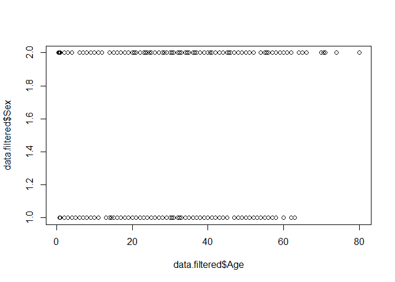

Titanic
================
Venkatramani Rajgpal

### Initialise

``` r
# load the data
data <- read.csv('titanic_training.csv', header = TRUE)
```

Exclude NA's. Check if row has NA's and remove them.

``` r
row.na <- apply(data, 1, function(x){any(is.na(x))})
sum(row.na)
```

    ## [1] 177

``` r
data.filtered <- data[!row.na,]
```

### Check correlation between Age and Fare

``` r
c <- cor.test(data.filtered$Age,data.filtered$Fare,method = "pearson") 
c
```

    ## 
    ##  Pearson's product-moment correlation
    ## 
    ## data:  data.filtered$Age and data.filtered$Fare
    ## t = 2.5753, df = 712, p-value = 0.01022
    ## alternative hypothesis: true correlation is not equal to 0
    ## 95 percent confidence interval:
    ##  0.02285549 0.16825304
    ## sample estimates:
    ##        cor 
    ## 0.09606669

We see 9.6% correlation between Age and the Fare.

### Check for independence.

We first create a contingency table

``` r
tb1 = table(data.filtered$Survived,data.filtered$Pclass)
tb1  # contingency table
```

    ##    
    ##       1   2   3
    ##   0  64  90 270
    ##   1 122  83  85

``` r
# Setting `correct=FALSE` to turn off Yates' continuity correction.
chisq.test(tb1,correct = FALSE)
```

    ## 
    ##  Pearson's Chi-squared test
    ## 
    ## data:  tb1
    ## X-squared = 92.901, df = 2, p-value < 2.2e-16

``` r
tb2 = table(data.filtered$Survived,data.filtered$Sex)
chisq.test(tb2)
```

    ## 
    ##  Pearson's Chi-squared test with Yates' continuity correction
    ## 
    ## data:  tb2
    ## X-squared = 205.03, df = 1, p-value < 2.2e-16

``` r
tb3 = table(data.filtered$Survived,data.filtered$Age)
chisq.test(tb3)
```

    ## Warning in chisq.test(tb3): Chi-squared approximation may be incorrect

    ## 
    ##  Pearson's Chi-squared test
    ## 
    ## data:  tb3
    ## X-squared = 104.16, df = 87, p-value = 0.1014

The warning message found in the solution above is due to the small cell values in the contingency table.

### Plotting distributions of Age vs Gender

``` r
plot(data.filtered$Age,data.filtered$Sex)
```



### Fitting a Logistic regression

Use `subset()` function and select only the relevant variables for the required Logistic regression model.

``` r
# Subsetting data for Survived ~ Pclass + Sex + Age + Fare.
data.subset <- subset(data.filtered,select=c(2,3,5,6,10))
```

Split the data into training set and test set.

``` r
train <- data.subset[1:650,]
test <- data.subset[651:714,]
```

Logistic regression models the conditional probability, *P*(*Y* = 1|*X* = *x*) as a function of *x*, that *Y* belongs to a particular category. Expressing mathematically,

$\\frac {\\log p(x)}{1-p(x)}$ = *β*<sub>0</sub> + *X**β*<sub>1</sub>, where *p*(*x*) = *P*(*y* = 1|*x*).

The unknown parameters,*β*<sub>0</sub>, *β*<sub>1</sub> in the function are estimated by maximum likelihood method using available input training data. The Maximum likelihood function expresses the probability of the observed data as a function of the unknown parameters. `glm()` takes training data as input and gives us the fitted model with estimated parameters as output. Fit the generalised linear model using `glm()` function. We take the Binomial parameter.

``` r
model <- glm(Survived ~ Pclass + Sex + Age + Fare,family=binomial(link='logit'),data=train)

summary(model)
```

    ## 
    ## Call:
    ## glm(formula = Survived ~ Pclass + Sex + Age + Fare, family = binomial(link = "logit"), 
    ##     data = train)
    ## 
    ## Deviance Residuals: 
    ##     Min       1Q   Median       3Q      Max  
    ## -2.7216  -0.6859  -0.4056   0.6561   2.4529  
    ## 
    ## Coefficients:
    ##               Estimate Std. Error z value Pr(>|z|)    
    ## (Intercept)  4.9768046  0.5977855   8.325  < 2e-16 ***
    ## Pclass      -1.2600897  0.1657854  -7.601 2.94e-14 ***
    ## Sexmale     -2.4957564  0.2175455 -11.472  < 2e-16 ***
    ## Age         -0.0369003  0.0080118  -4.606 4.11e-06 ***
    ## Fare         0.0002363  0.0021994   0.107    0.914    
    ## ---
    ## Signif. codes:  0 '***' 0.001 '**' 0.01 '*' 0.05 '.' 0.1 ' ' 1
    ## 
    ## (Dispersion parameter for binomial family taken to be 1)
    ## 
    ##     Null deviance: 878.06  on 649  degrees of freedom
    ## Residual deviance: 593.30  on 645  degrees of freedom
    ## AIC: 603.3
    ## 
    ## Number of Fisher Scoring iterations: 5

The statistically significant variables, sex has the lowest p-value suggesting a strong association of the sex of the passenger with the probability of having survived.

The negative coefficient for this predictor suggests that all other variables being equal, the male passenger is less likely to have survived.

Run a Anova on the model to analyse the table of deviation.

``` r
anova(model)
```

    ## Analysis of Deviance Table
    ## 
    ## Model: binomial, link: logit
    ## 
    ## Response: Survived
    ## 
    ## Terms added sequentially (first to last)
    ## 
    ## 
    ##        Df Deviance Resid. Df Resid. Dev
    ## NULL                     649     878.06
    ## Pclass  1   80.514       648     797.54
    ## Sex     1  180.839       647     616.70
    ## Age     1   23.389       646     593.31
    ## Fare    1    0.012       645     593.30

### Evaluation

Predicting *y* on the new test data set. By setting the parameter type='response', output probabilities are in the form of *P*(*y* = 1|*x*). Taking decision boundary as 0.5 as threshold. If *P*(*y* = 1|*x*)&gt;0.5 then *y* = 1 otherwise *y* = 0.

``` r
fitted.results <- predict(model,newdata=subset(test,type='response'))
fitted.results <- ifelse(fitted.results > 0.5,1,0)

misClasificError <- mean(fitted.results != test$Survived)
print(paste('Accuracy',1-misClasificError))
```

    ## [1] "Accuracy 0.8125"

We see a 81.5% accuracy that the test set is correctly classified.
